# TesteDSIN

## Requisitos
- Python 3.12.0

## Setup

``` 
git clone https://github.com/marcoshronzani/TesteDSIN.git
cd TesteDSIN
cp contrib\env-sample .env
python -m venv .venv
.venv\scripts\activate
pip install -r requirements.txt
python manage.py migrate
python manage.py loaddata initial_data.json
python manage.py runserver
```

## Acesso ao Sistema

O setup acima já cria e popula o banco de dados com três usuários, alguns agendamentos e serviços.

Usuário Admin
````
leila@cabeleleila.com.br
````
Senha Admin
````
leila
````

Usuário Cliente 1
````
marcosronzani@gmail.com
````
Senha Cliente 1
````
Marcos123
````

Usuário Cliente 2
````
amandaronzani@gmail.com
````
Senha Cliente 2
````
Amanda123
````

## Fotos
### Tela_Cadastro
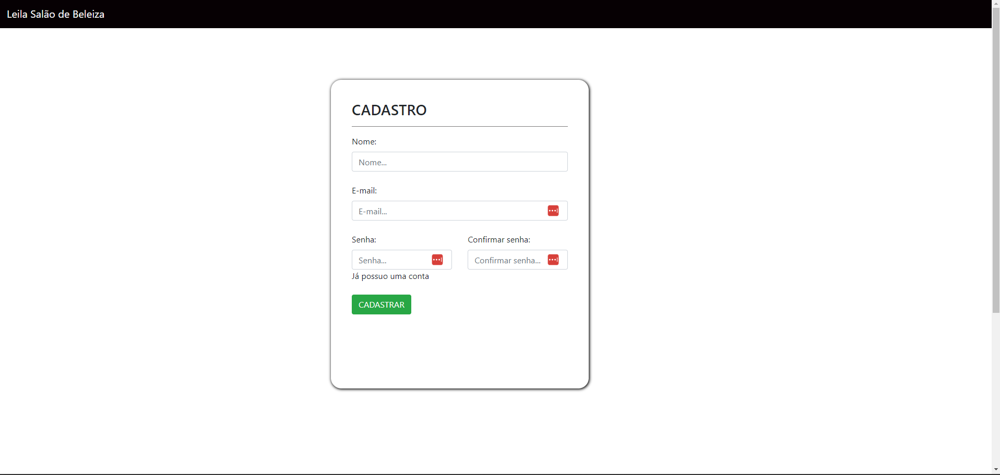

### Tela_Login
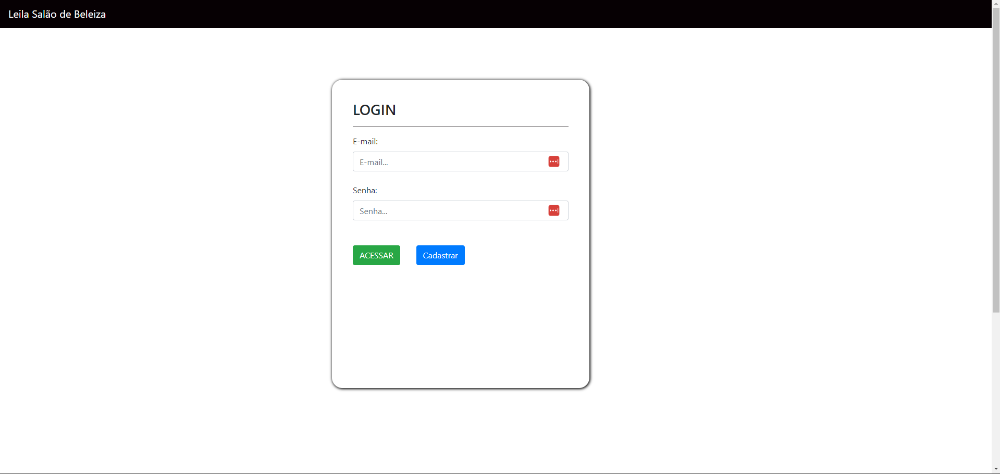

### Tela_Menu_Cliente
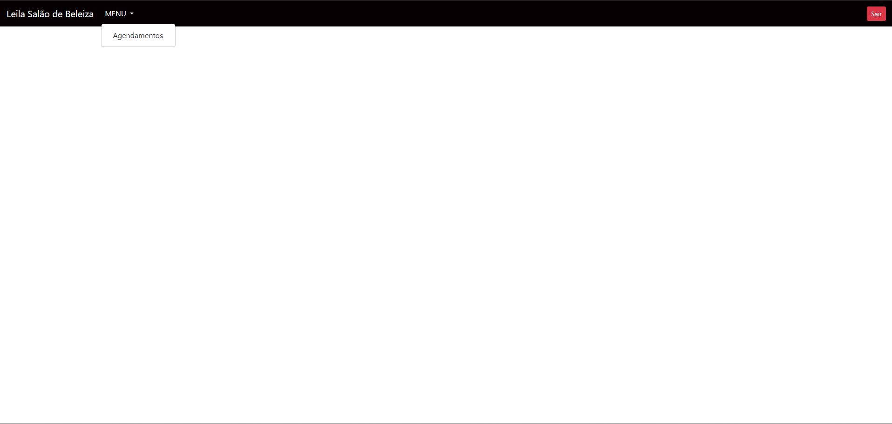

### Tela_Agendamentos_Cliente
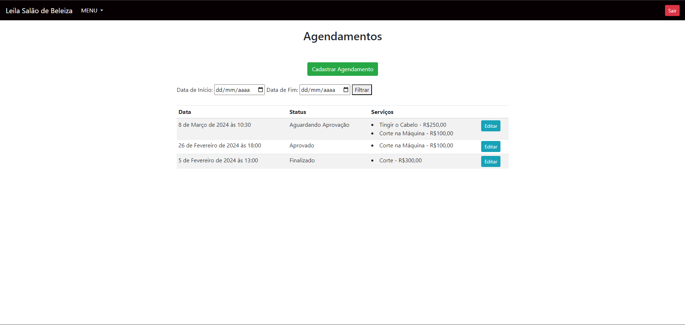

### Tela_Cadastro_Agendamento_Cliente
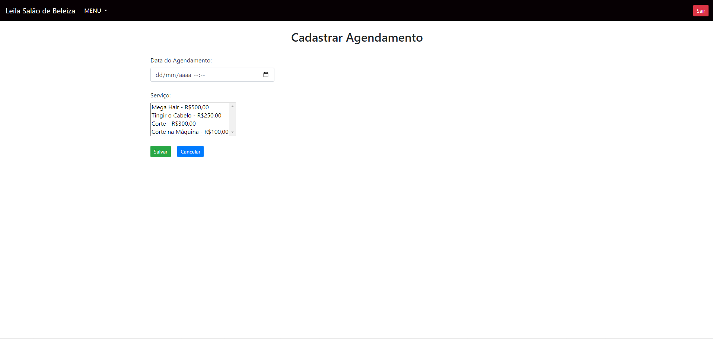

### Tela_Editar_Agendamento_Cliente
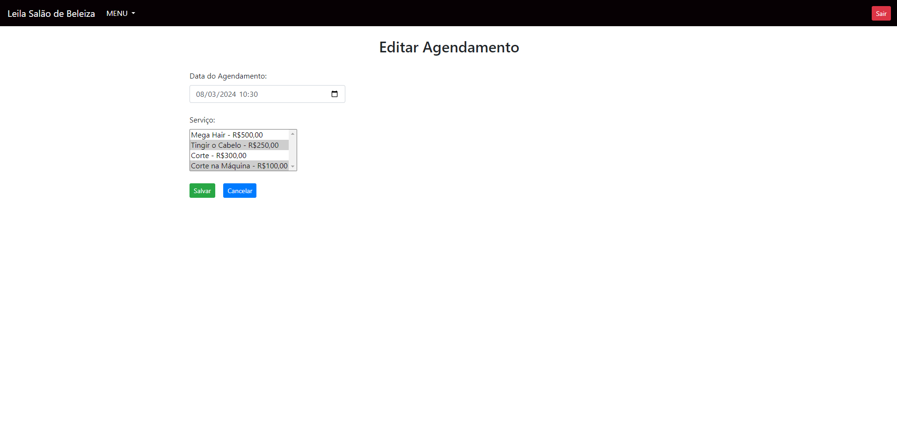

### Tela_Menu_Adm
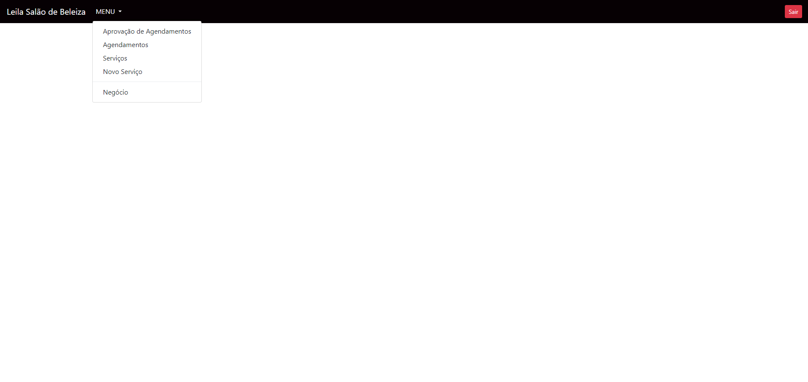

### Tela_Aprovação_Adm
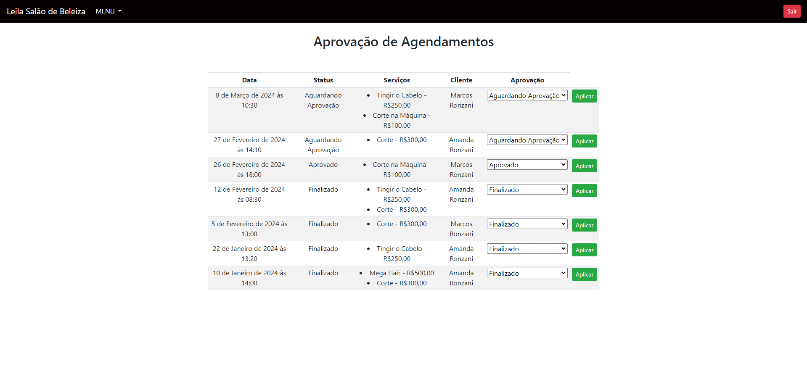

### Tela_Agendamentos_Adm
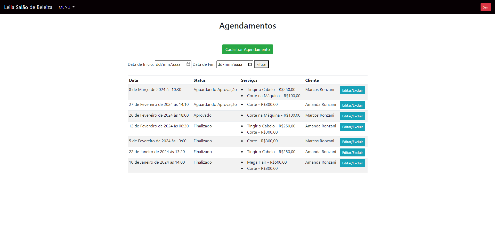

### Tela_Editar_Agendamento_Adm
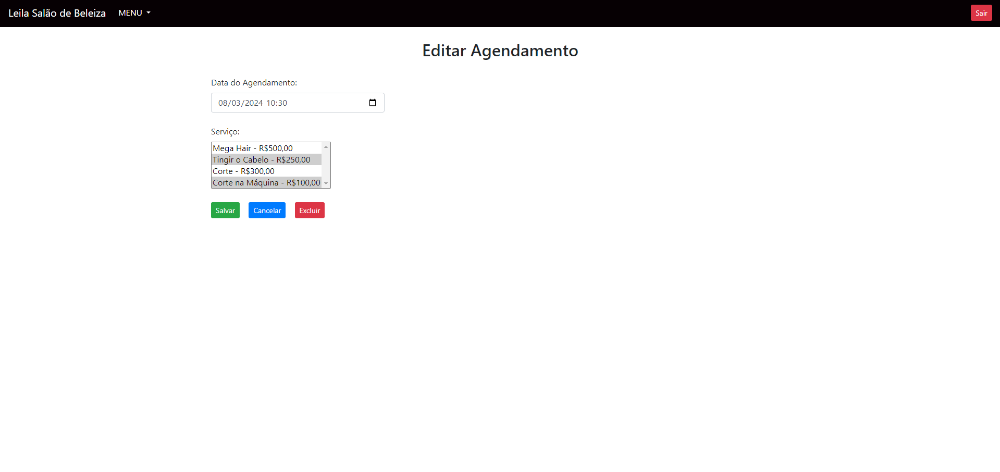

### Tela_Confirma_Exclusão_Agendamento_Adm
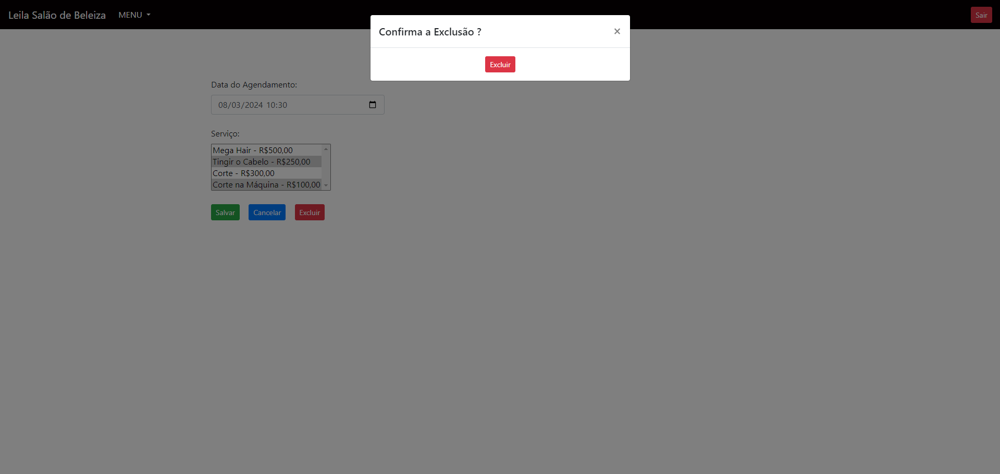

### Tela_Serviços_Adm
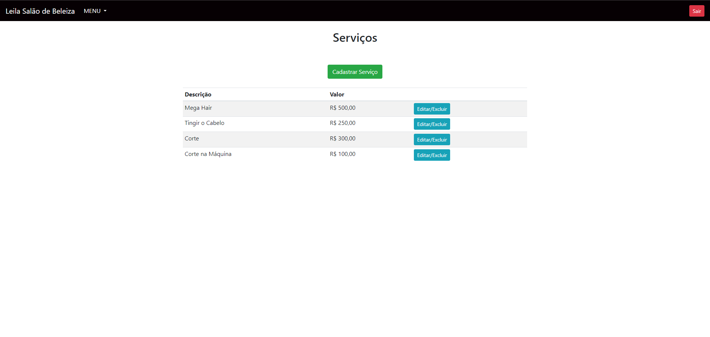

### Tela_Cadastro_Serviço_Adm
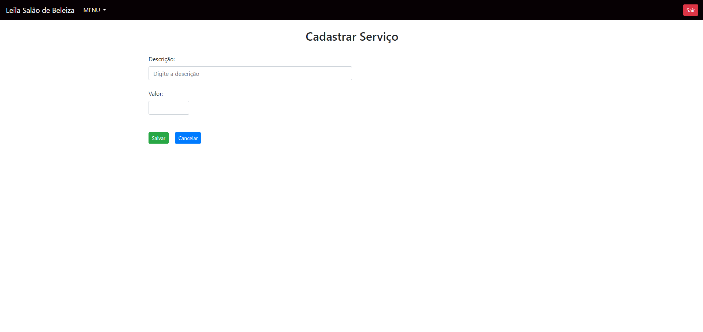

### Tela_Editar_Serviço_Adm
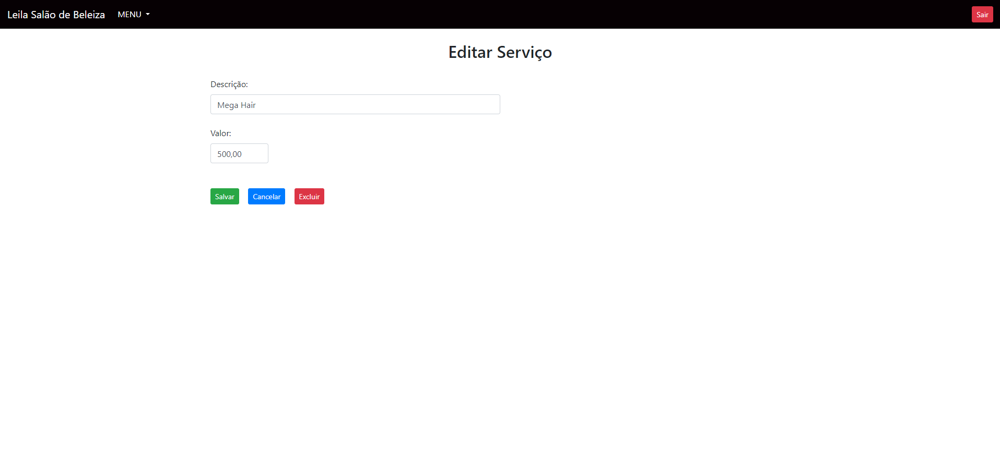

### Tela_Acompanhamento_Adm
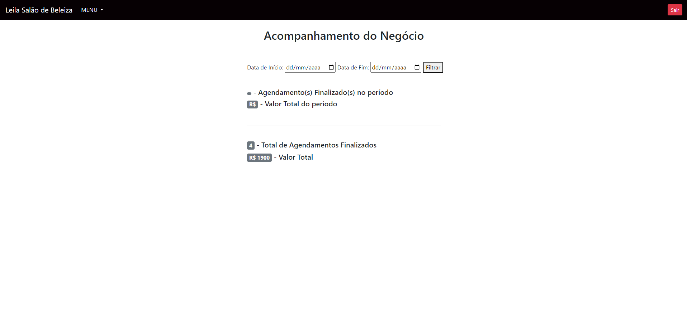